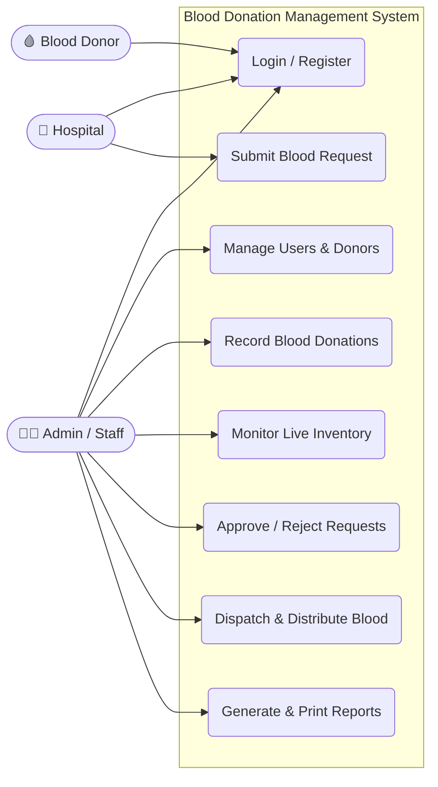
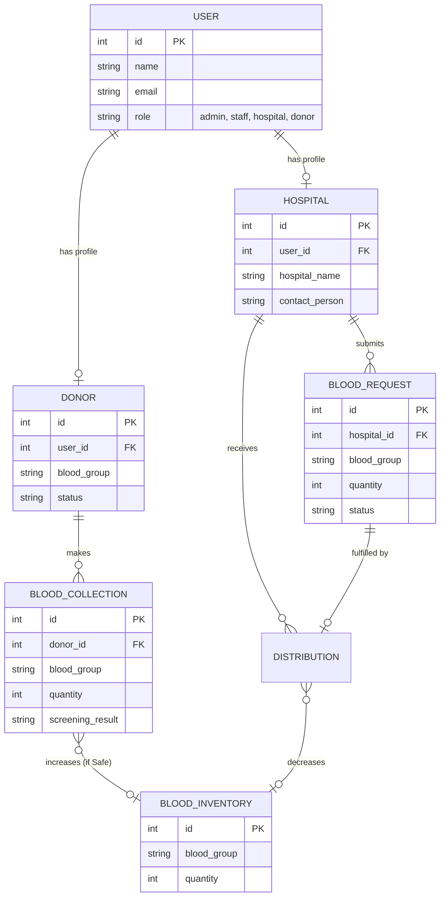
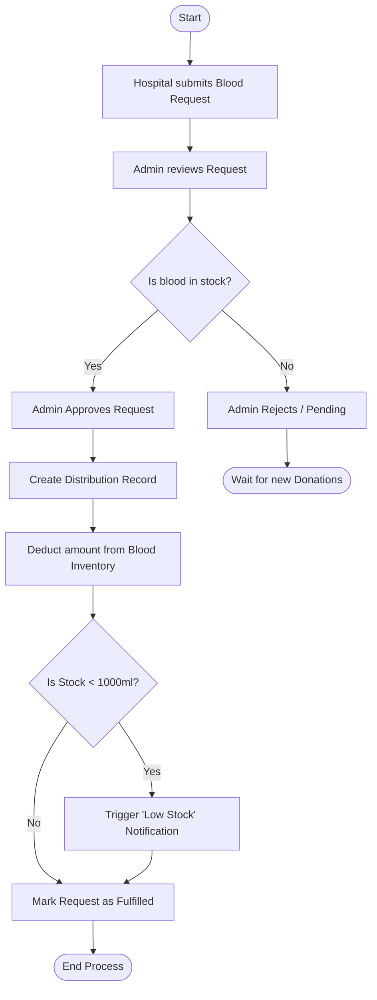

# Blood Donation Management System

A comprehensive, responsive, and robust web application built with **Laravel 12** and **Bootstrap 5** to automate and streamline blood bank operations, from donor registration to blood distribution.

## Key Features
- **Role-Based Access Control**: Secure logins for Admins, Staff, Donors, and Hospitals.
- **Donor Management**: Register donors, track medical history, and record donations.
- **Real-Time Inventory**: Automated tracking of blood stock levels across all blood groups.
- **Hospital Blood Requests**: Hospitals can submit blood requests, specifying urgency levels.
- **Distribution Module**: Automated deduction of inventory upon request fulfillment.
- **Reports Module**: Generate and print detailed reports for Donors, Inventory, Requests, and Distributions.
- **Smart Notifications**: Built-in alerts for low blood stock and request status updates.
- **Modern UI**: Dark/Light mode toggle, DataTables for advanced sorting/searching, and SweetAlert2 for beautiful popups.

## Technologies Used
- Backend: **Laravel 12 (PHP 8.2+)**
- Database: **MySQL** via Eloquent ORM
- Frontend: **Bootstrap 5, FontAwesome 6, DataTables, SweetAlert2**

---

## Installation & Setup

1. **Clone or Extract the Project**
2. **Configure Environment**
   Update your `.env` file to connect to your local MySQL database:
   ```env
   DB_CONNECTION=mysql
   DB_HOST=127.0.0.1
   DB_PORT=3306
   DB_DATABASE=blood_donation_db
   DB_USERNAME=root
   DB_PASSWORD=
   ```
3. **Run Migrations and Seeders**
   This will build the database schema and populate it with sample data:
   ```bash
   php artisan migrate:fresh --seed
   ```
4. **Start the Application**
   ```bash
   php artisan serve
   ```
   Navigate to `http://localhost:8000` or via XAMPP `http://localhost/Blood%20Donation%20Management/public/`.

---

## Default Test Accounts
- **Admin**: `admin@bloodbank.com` / `password`
- **Staff**: `staff@bloodbank.com` / `password`
- **Hospital**: `contact@cityhospital.com` / `password`
- **Donor**: `john@donor.com` / `password`

---

## System Diagrams

### 1. Use Case Diagram
Visualizes how different user roles interact with the system's features.



### 2. Entity Relationship Diagram (ERD)
Maps the database architecture and relationships between core models.



### 3. Workflow Flowchart (Request & Distribution Lifecycle)
Illustrates the step-by-step logic when a hospital requests blood.


